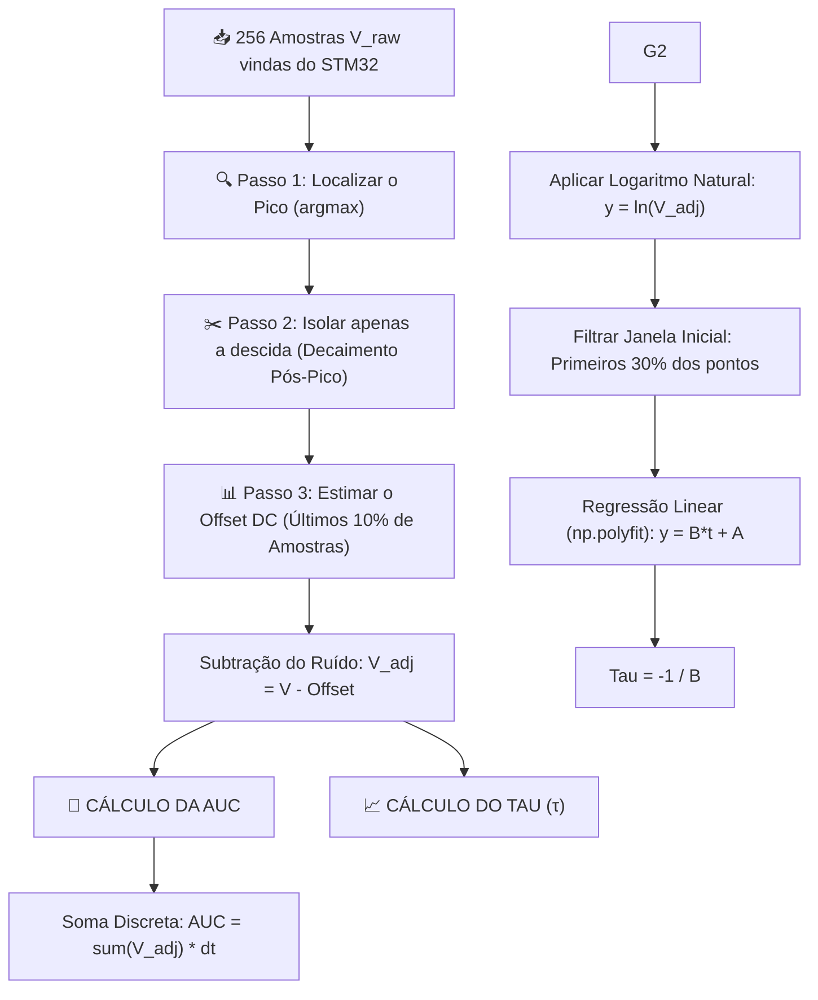

# Resumo Executivo e Técnico do Projeto: Monitoramento de Corrosão por Correntes Parasitas (Pulsed Eddy Currents - PECT)

---

## 📌 1. Visão Geral do Projeto (Overview)

O projeto consiste em uma bancada experimental e industrial completa para **detecção, quantificação e classificação não destrutiva de degradação/corrosão em estruturas metálicas** (como torres de transmissão e chapas de aço A36) utilizando a técnica de **Ensaios por Correntes Parasitas Pulsadas (Pulsed Eddy Current Testing - PECT)**.

O sistema é dividido em duas partes fundamentais:

1. **Firmware de Alta Velocidade (C / STM32H753ZI)**: Microcontrolador embarcado focado em aquisição analógica de ultra-alta velocidade via ADC/DMA, excitação precisa de bobinas sensoras e transmissão de dados binários sem jitter via UART/USB (921.600 bps com validação CRC-16-CCITT).
2. **Interface Gráfica e Suíte de Inteligência Artificial (Python / PyQt5 / PyQtGraph)**: Software de bancada responsável por controlar o hardware em tempo real, plotar gráficos a 10 Hz com baixíssima latência, extrair parâmetros característicos de decaimento transiente ($\tau$ e $\text{AUC}$), gerenciar bancos de dados com cache inteligente e classificar automaticamente os níveis de corrosão utilizando Machine Learning.

---

## 🏗️ 2. Arquitetura Geral do Sistema

```mermaid
graph TD
    subgraph Hardware & Sensores
        S[Bobina Sensora / Sensor Indutivo] -->|Decaimento V(t)| A[Placa NUCLEO-H753ZI]
        L[Espaçadores de Lift-Off: 0.0mm a 5.0mm] --> S
    end

    subgraph Firmware Embarcado (STM32H7)
        A -->|ADC + Timer Trigger| D[Buffer DMA]
        D -->|Clock DWT + Payload| C[Calculador CRC-16-CCITT]
        C -->|VCP USB 921.600 bps| U[UART TX Direct]
    end

    subgraph Software PC (Python Suite)
        U -->|SerialWorker Thread| P[Parser Binário + Validação CRC]
        P -->|Sinal Limpo 10 Hz| G[GUI PyQt5 / PyQtGraph]
        G -->|Módulo 1: Monitoramento Genérico| M1[Osciloscópio Live & Análise Transiente]
        G -->|Módulo 2: Caracterização de Bobinas| M2[Medição de Indutância & Matriz Lift-Off]
        
        M2 -->|Extração DSP| F[Extrator de Métricas: Tau, AUC, Lef]
        F -->|Classificador IA| K[Classificador por Centroides + IQR Outliers]
        F -->|Dataset Cache| DS[DatasetManager em RAM]
    end
```

---

## ⚡ 3. Firmware Embarcado (STM32H753ZI)

### 3.1. Hardware & Periféricos Utilizados

- **Microcontrolador**: STM32H753ZIT6 (ARM Cortex-M7 rodando a 480 MHz).
- **Periféricos de Sinal**:
  - **TIM (Timers)**: Disparo periódico de pulsos de excitação e sincronismo do ADC com jitter zero.
  - **ADC (Analog-to-Digital Converter)**: Digitalização de 256 amostras por pulso de transiente de tensão $V(t)$ na bobina.
  - **DMA (Direct Memory Access)**: Transferência direta dos dados do ADC para a memória e da memória para a UART TX sem intervenção da CPU.
  - **DWT (Data Watchpoint and Trace)**: Utilizado para medição exata do número de ciclos de clock da CPU consumidos durante a amostragem.

### 3.2. Otimizações de Firmware

- **Mascaramento de Seção Crítica**: Desabilitação temporária de interrupções no momento do pulso para evitar qualquer variação de tempo (jitter).
- **Timeout no Parser Serial**: Segurança de **100 ms** na recepção de comandos via UART para prevenir bloqueios de firmware.

---

## 🔌 4. Protocolo de Comunicação Serial (VCP USB / DMA)

- **Taxa de Transmissão**: 921.600 bps via Virtual COM Port (VCP USB).
- **Tamanho do Pacote Binário**: **518 Bytes** (ou 522 bytes com alinhamento de cabeçalho).
- **Estrutura da Carga Útil (Payload)**:

| Offset (Bytes) | Tamanho (Bytes) | Tipo | Descrição |
| --- | --- | --- | --- |
| `0 .. 511` | 512 | `uint16_t[256]` | 256 Amostras brutas do decaimento transiente de indutância $V(t)$ |
| `512 .. 515` | 4 | `uint32_t` | Ciclos de CPU medidos pelo periférico DWT |
| `516 .. 517` | 2 | `uint16_t` | Checksum de segurança **CRC-16-CCITT** (little-endian, polinômio `0x1021`, init `0xFFFF`) |

- **Tratamento no PC**: O script `SerialWorker` em Python executa uma rotina em thread separada que valida o CRC-16 antes de atualizar o buffer de tela. Se o pacote for corrompido, ele é rejeitado instantaneamente.

---

## 🟢 5. O Fenômeno Físico do Ensaio PECT

Quando colocamos a bobina sensora sobre a chapa metálica de aço (A36) e injetamos um **pulso elétrico rápido**:

1. A bobina gera um campo magnético momentâneo que "penetra" no metal.
2. Quando o pulso é desligado bruscamente, o campo magnético não desaparece instantaneamente: ele induz **correntes elétricas parasitas (*eddy currents*)** dentro do aço.
3. Essas correntes vão se dissipando no metal e geram uma tensão de retorno na bobina que **decai gradualmente no tempo**, formando a curva transiente $V(t)$.

### **As Duas Métricas Fundamentais:**
- 📐 **AUC (Área Sob a Curva / Area Under Curve):** Mede a **quantidade total de energia acumulada** sob o sinal durante a descida. Se a chapa tiver menor espessura (corrosão) ou se o sensor se afastar (*Lift-Off*), a área total encolhe.
- ⏱️ **$\tau$ (Tau / Constante de Tempo):** Mede a **velocidade com que o sinal atenua**. Quanto mais espesso for o metal, mais tempo o campo leva para se dissipar (decaimento mais lento $\implies \tau$ maior).

---

## 🧮 6. Processamento Digital de Sinais (DSP) e Equacionamento Matemático

### 6.1. Fluxograma do Algoritmo de Extração de Parâmetros



---

### 6.2. Detalhamento do Equacionamento Matemático

#### **Passo 1: Detecção do Pico e Isolamento da Janela Transiente**
Dada a sequência discreta $V_{\text{raw}}[i]$ de $N=256$ pontos com período de amostragem $\Delta t$:
$$i_{\text{peak}} = \arg\max_{i \in \{0, \dots, N-1\}} \left(V_{\text{raw}}[i]\right)$$
$$V[k] = V_{\text{raw}}[i_{\text{peak}} + k], \quad \text{para } k = 0, 1, \dots, M-1$$

#### **Passo 2: Offset Dinâmico da Cauda ($V_{\text{offset}}$)**
Estimado pela média das últimas 10% de amostras ($N_{\text{tail}}$):
$$N_{\text{tail}} = \max\left(5, \lfloor 0.10 \times M \rfloor\right)$$
$$V_{\text{offset}} = \frac{1}{N_{\text{tail}}} \sum_{k = M - N_{\text{tail}}}^{M - 1} V[k]$$
$$V_{\text{adj}}[k] = \max\left(0, \, V[k] - V_{\text{offset}}\right)$$

#### **Passo 3: Área Sob a Curva ($\text{AUC}$ / ROC)**
Calculada por integração discreta (Soma de Riemann):
$$\text{AUC} = \sum_{k=0}^{M-1} V_{\text{adj}}[k] \cdot \Delta t \quad [\text{Counts} \cdot \mu\text{s}]$$

#### **Passo 4: Constante de Tempo ($\tau$) por Regressão Log-Linear**
Modelando o sinal como uma exponencial de primeira ordem $V_{\text{adj}}(t) = V_0 \cdot e^{-t/\tau}$:
$$\ln\left(V_{\text{adj}}(t)\right) = \ln(V_0) - \frac{1}{\tau} \cdot t \implies y(t) = B \cdot t + A$$

Aplicando a **Regressão Linear por Mínimos Quadrados** nos **primeiros 30% das amostras** ($M_{\text{fit}} = 0.3 M$):
$$B = \frac{M_{\text{fit}} \sum_{k=0}^{M_{\text{fit}}-1} (t[k] \cdot y[k]) - \left( \sum_{k=0}^{M_{\text{fit}}-1} t[k] \right) \left( \sum_{k=0}^{M_{\text{fit}}-1} y[k] \right)}{M_{\text{fit}} \sum_{k=0}^{M_{\text{fit}}-1} (t[k]^2) - \left( \sum_{k=0}^{M_{\text{fit}}-1} t[k] \right)^2}$$
$$\tau = -\frac{1}{B}$$

---

### 6.3. Fundamentação Física Avançada: Resposta Bi-Exponencial

Na física de difusão magnética de PECT em chapas de aço A36 (governada por $\nabla^2 \mathbf{H} = \mu \sigma \frac{\partial \mathbf{H}}{\partial t}$), a tensão induzida resulta em uma solução bi-exponencial:

$$V(t) \approx A_1 e^{-\frac{t}{\tau_1}} + A_2 e^{-\frac{t}{\tau_2}} + V_{\text{offset}}$$

1. **Modo Rápido Superficial ($\tau_1$):** Governa os instantes iniciais ($t < t_{\text{transiente}}$), influenciado pela auto-indutância da bobina e pelo efeito de pele (*skin effect*).
2. **Modo Lento Dominante ($\tau_2$ ou $\tau_e$):** Governa a cauda do sinal e relaciona-se com a espessura da chapa $d$, condutividade $\sigma$ e permeabilidade $\mu$:
$$\tau_e = \frac{\mu \, \sigma \, d^2}{\pi^2}$$

> 💡 **Conexão com o SciLab:** O nosso algoritmo ajusta $\tau$ nos primeiros 30% da curva, isolando o modo $\tau_1$ com alta repetibilidade. Um ajuste mono-exponencial em toda a curva no SciLab deixa resíduo porque tenta forçar uma única reta em um fenômeno que possui duas inclinações distintas ($\tau_1$ e $\tau_2$).

---

### 6.4. Mapeamento Exato das Equações no Código Python

As equações estão implementadas em dois locais no repositório:

1. **Função Central Reutilizável**: [`gui/utils.py`](file:///c:/Users/AdmPDI/STM32CubeIDE/workspace3/anticorrosao-firmware-eddy-currents-test/documenta%C3%A7%C3%A3o/Testes/Testes%20de%20Eddy%20Current/gui/utils.py#L47-L85) (Linhas 47 a 85).
2. **Loop de Processamento do Osciloscópio da GUI**: [`eddy_current_plotter_gui.py`](file:///c:/Users/AdmPDI/STM32CubeIDE/workspace3/anticorrosao-firmware-eddy-currents-test/documenta%C3%A7%C3%A3o/Testes/Testes%20de%20Eddy%20Current/eddy_current_plotter_gui.py#L3561-L3615) (Linhas 3561 a 3615).

```python
# Trecho de gui/utils.py:
peak_idx = np.argmax(valores_arr)                     # 1. Pico
decay = valores_arr[peak_idx:]
n_final = max(5, int(len(decay) * 0.1))               # 2. Offset dinâmico (10% finais)
offset = np.mean(decay[-n_final:])
decay_adj = np.clip(decay - offset, 0, None)
auc = np.sum(decay_adj) * dt_us                        # 3. Equação da AUC
decay_log = np.clip(decay - offset, 1e-5, None)
n_fit = int(len(decay_log) * 0.3)                      # 4. Primeiros 30% dos pontos
y_log = np.log(decay_log[:n_fit])
t_fit = np.arange(n_fit) * dt_us
B, A = np.polyfit(t_fit, y_log, 1)                     # 5. Regressão Linear
tau = -1.0 / B if B != 0 else 0.0                      # 6. Equação do Tau
```

---

## 🖥️ 7. Software PC e Interface Gráfica (`eddy_current_plotter_gui.py`)

A interface foi desenvolvida utilizando **PyQt5** e **PyQtGraph**, dividida em 5 abas principais:

1. **Aba 1: Transiente do Sinal $V(t)$**: Osciloscópio em tempo real com FFT, derivadas $dV/dt$, visualização de envelope e ajuste da janela de amostragem.
2. **Aba 2: Espaço de Fase e Histórico**: Diagrama de espaço de fase ($V(t)$ vs $dV/dt$) e histórico de medições.
3. **Aba 3: Diagnóstico do Hardware**: Monitor de temperatura do MCU, ciclos DWT, taxa de perda de pacotes e status serial.
4. **Aba 4: Matriz de Validação & Acurácia**: Testes em lote de cupons com matriz de confusão e métricas do classificador IA.
5. **Aba 5: Módulo de Caracterização de Bobinas**: Gerenciador avançado para cadastro de sensores/bobinas, cupons de materiais, varredura por distância de Lift-Off e gráficos estatísticos.

---

## 📁 8. Padronização dos Arquivos CSV e Novas Colunas `tau_us` / `auc_counts`

### 8.1. Estrutura de Nomenclatura Padrão
$$\text{\{ID\_BOBINA\}-\{BASE\}-\{DISTANCIA\}mm-\{ID\_AMOSTRA\}-\{COD\_MATERIAL\}-\{COD\_CLASSE\}-\{COD\_LOCAL\}-\{TIMESTAMP\}.csv}$$

### 8.2. Inclusão das Colunas Calculadas nos CSVs
Para permitir a validação direta de dados no SciLab/MATLAB, todos os arquivos gravados pelo sistema agora salvam automaticamente as colunas **`tau_us`** e **`auc_counts`**:

```csv
id_amostra;base;local;id_bobina;indutancia_uh;resistencia_ohm;diametro_mm;altura_mm;espiras;fio_awg;nucleo;distancia_mm;ajuste_manual_liftoff;material;classe;timestamp;dt_us;tau_us;auc_counts;p_0;p_1;...;p_255
001;P;Não Especificado;681;697.00;2.30;12.7;10.9;0;NA;FER;0.7;Não;Ar Livre;Ar Livre;2026-08-07 17:08:40;0.22674;6.5259;409522.93;61867;60191;...
```

* **Migração Concluída**: Todos os 10 arquivos históricos de caracterização (10.000 curvas) na pasta `datasets/caracterizacao_bobinas` foram migradas em lote para conterem essas novas colunas.

---

## 🧠 9. Inteligência Artificial e Classificação de Níveis de Corrosão

O sistema classifica a saúde do material em 6 categorias de corrosão:
- **SA**: Saudável (Sem corrosão) | **LE**: Leve | **MO**: Moderada | **AV**: Avançada | **CO**: Corroído Severo | **AL**: Ar Livre

- **Espaço de Características**: O par de métricas $(\tau, \text{AUC})$ é normalizado por Z-Score ou MinMax.
- **Limpeza de Ruído (IQR)**: Aplicação do filtro **Interquartile Range (IQR)** para desconsiderar automaticamente amostras espúrias.
- **Classificador por Centroides**: O modelo calcula a Distância Euclidiana Ponderada em relação aos centroides médios das classes cadastradas.

---

## ⚡ 10. Mecanismo de Cache de Alta Performance (`DatasetManager`)

- Devido ao tamanho elevado do banco de dados principal (19 MB com mais de 14.000 amostras), a leitura em disco causava congelamentos na GUI.
- **Solução (`gui/dataset_manager.py`)**: Cache persistente em memória RAM validado automaticamente por `os.stat().st_mtime` e `st_size`.

---

## 📊 11. Otimizações Visuais e Monitoramento em Tempo Real (Sub-Aba 2)

1. **Eliminação do Pisca-Pisca na Sub-Aba 2**: Removido o bloco `else` conflitante. O painel HTML de monitoramento live agora exibe de forma contínua o sensor ativo, Lift-Off, contagem de amostras, Tau e AUC sem oscilação de tela.
2. **Sinal Live Verde Neon**: Renderizado a 10 Hz com opacidade suave (`rgba(0, 255, 0, 0.70)`).
3. **Média Móvel Selecionável**: Convolução linear com seletor lateral (`Desativada`, `10`, `50`, `100` amostras).
4. **Tooltip Interativo Pinned (`CustomFloatingTooltipWidget`)**: Redesign de 1px, cálculo via `heightForWidth` para eliminar avisos no Windows.

---

## 📚 12. Publicações Científicas de Referência (Open Access & Download PDF)

1. 📄 **Ulapane, N., et al. (2017).** *Pulsed Eddy Current Sensing for Critical Pipe Condition Assessment.* MDPI Sensors, 17(10), 2208.  
   🔗 [Página do Artigo (MDPI Sensors)](https://www.mdpi.com/1424-8220/17/10/2208) | ⬇️ [Download Direto do PDF Completo](https://www.mdpi.com/1424-8220/17/10/2208/pdf)
2. 📄 **Ge, J., et al. (2020).** *Defect Classification Using Postpeak Value for Pulsed Eddy-Current Technique.* MDPI Sensors, 20(12), 3390.  
   🔗 [Página do Artigo (MDPI Sensors)](https://www.mdpi.com/1424-8220/20/12/3390) | ⬇️ [Download Direto do PDF Completo](https://www.mdpi.com/1424-8220/20/12/3390/pdf)
3. 📄 **Wang, H., et al. (2022).** *A Novel Pulsed Eddy Current Criterion for Non-Ferromagnetic Metal Thickness Quantifications under Large Liftoff.* MDPI Sensors, 22(2), 614.  
   🔗 [Página do Artigo (MDPI Sensors)](https://www.mdpi.com/1424-8220/22/2/614) | ⬇️ [Download Direto do PDF Completo](https://www.mdpi.com/1424-8220/22/2/614/pdf)
4. 📄 **Yu, X., et al. (2023).** *Time-Domain Numerical Simulation and Experimental Study on Pulsed Eddy Current Inspection of Tubing and Casing.* MDPI Sensors, 23(3), 1135.  
   🔗 [Página do Artigo (MDPI Sensors)](https://www.mdpi.com/1424-8220/23/3/1135) | ⬇️ [Download Direto do PDF Completo](https://www.mdpi.com/1424-8220/23/3/1135/pdf)
5. 📄 **Han, L., et al. (2024).** *Design and Study of Pulsed Eddy Current Sensor for Detecting Surface Defects in Small-Diameter Bars.* MDPI Sensors, 24(24), 8063.  
   🔗 [Página do Artigo (MDPI Sensors)](https://www.mdpi.com/1424-8220/24/24/8063) | ⬇️ [Download Direto do PDF Completo](https://www.mdpi.com/1424-8220/24/24/8063/pdf)
6. 📄 **Wang, Y., et al. (2024).** *Circumferential Crack Detection in Ultra-High-Pressure Tubular Reactors with Pulsed Eddy Current Testing.* MDPI Sensors, 24(20), 6599.  
   🔗 [Página do Artigo (MDPI Sensors)](https://www.mdpi.com/1424-8220/24/20/6599) | ⬇️ [Download Direto do PDF Completo](https://www.mdpi.com/1424-8220/24/20/6599/pdf)
7. 📄 **Ulapane, N., & Nguyen, L. (2019).** *Review of Pulsed-Eddy-Current Signal Feature-Extraction Methods for Conductive Ferromagnetic Material-Thickness Quantification.* MDPI Electronics, 8(5), 470.  
   🔗 [Página do Artigo (MDPI Electronics)](https://www.mdpi.com/2079-9292/8/5/470) | ⬇️ [Download Direto do PDF Completo](https://www.mdpi.com/2079-9292/8/5/470/pdf)
8. 📄 **Li, Y., et al. (2017).** *A Gradient-Field Pulsed Eddy Current Probe for Evaluation of Hidden Material Degradation in Conductive Structures Based on Lift-Off Invariance.* MDPI Sensors, 17(5), 943.  
   🔗 [Página do Artigo (MDPI Sensors)](https://www.mdpi.com/1424-8220/17/5/943) | ⬇️ [Download Direto do PDF Completo](https://www.mdpi.com/1424-8220/17/5/943/pdf)

---
*Documento executivo e técnico preparado para consumo e síntese automática pelo Google NotebookLM.*
